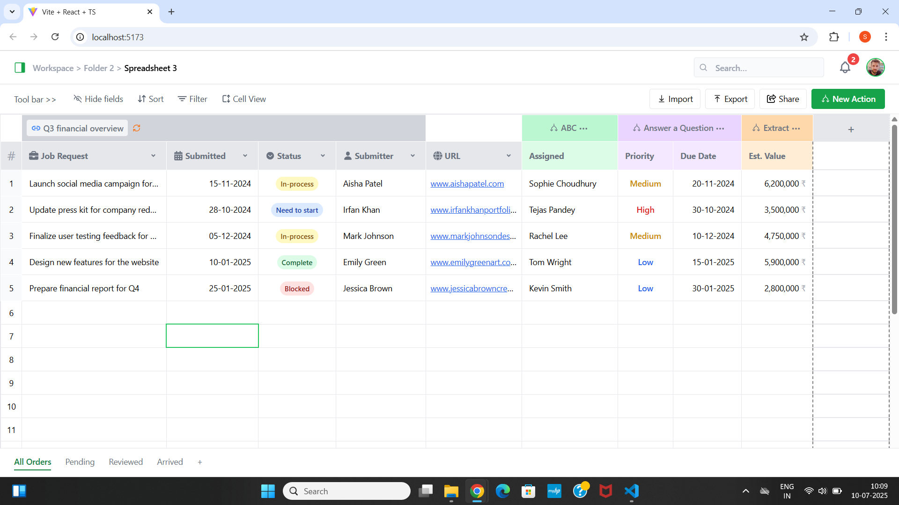

# React Spreadsheet UI

A pixel-perfect, spreadsheet-style UI built using React, TypeScript, TailwindCSS, and @tanstack/react-table (v8). This component mimics the look and feel of Excel/Google Sheets with sorting, editable cells, dynamic rows & columns, sticky headers, floating dropdowns, and responsive UI.

## ✨ Features

- Spreadsheet-like interface using `@tanstack/react-table`
- Sorting capabilities on all columns
- Dynamic column addition via `+` icon
- Editable empty rows
- Super header rows with custom `colSpan` and icons
- Sticky toolbar and footer
- Floating dropdown menu (like context menu)
- TailwindCSS-based consistent design

## ⚙️ Setup

### 1. Install dependencies

```bash
npm install
```

### 2. Run the dev server

```bash
npm run dev
```

### 3. Type Check and Lint

```bash
npm run lint
npm run type-check
```

## Folder Structure

```plain text
src/
│
├── components/
│   ├── Spreadsheet.tsx       # Main spreadsheet UI component
│   └── FloatingDropdown.tsx  # Reusable dropdown box
│
├── App.tsx                   # App entry point
└── main.tsx                  # React DOM render
```

## Trade-offs

### Custom UI over Library Defaults:
While ' @tanstack/react-table ' provides utilities for table behavior, much of the UI (headers, toolbars, sticky behavior) has been manually styled using TailwindCSS to match a precise Figma design. This gives full control over layout but increases maintenance complexity and may diverge from best practices.

### Super Header Manual Sync:
The super header row is implemented manually and synced with the dynamic column definitions. This approach gives high flexibility in styling and managing updates during dynamic column addition.

### Dynamic Columns Without Schema Binding:
New columns can be added on the fly and rendered, but the data entered is not stored. This achieves a Google Sheets–like experience but backend integration and data persistence is needed later.

### Simplified Data Entry Experience:
The editable rows are handled via contentEditable, avoiding complex state handling or form validation. This is a quick and lightweight solution but limits control over input formats, validation, and user feedback.

### Lightweight Dropdown Alternatives:
Instead of implementing full dropdown components, 'alert()' boxes are used to simulate interactions under three-dot icons. This reduces UI complexity but does not offer true interactivity or customization.

### No Virtualization or Pagination:
All rows are rendered directly without react-virtual or pagination. This ensures simplicity and immediate responsiveness for smaller datasets but may not be efficient for larger datasets.

### Minimal Accessibility Enhancements:
The table prioritizes visual fidelity and flexibility over strict accessibility features like keyboard navigation, ARIA roles, or screen-reader-friendly markup.

## Screenshot

Here is a preview of the spreadsheet UI:

